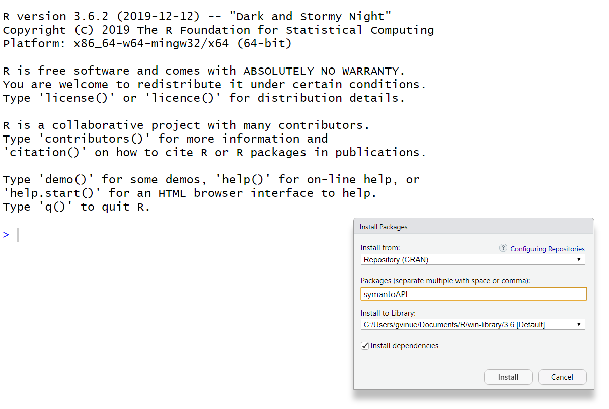

```{r setup, include=FALSE}
library(knitr)       # For knitting document and include_graphics.
library(kableExtra)  # Displays advanced tables.
knitr::opts_chunk$set(echo = TRUE)
```

This document introduces the R package **symantoAPI** for text analytics by calling the Symanto API. 

The following picture shows how the package can be installed from CRAN (The Comprehensive R Archive Network) on the user's desktop, when the package is eventually submitted there.

```{r fig1, echo = FALSE, out.width = "600px", out.height= "400px"}

```

Another alternative is to install the package from source:

```{r package source, eval=FALSE}
install.packages("path_to_file/symantoAPI_1.0.tar.gz", repos = NULL, type = "source")
```

Then, the package can be easily loaded in the R console. 

```{r packages, message=FALSE}
library(symantoAPI) 
```

Further information on package is available with these commands:

```{r info package, eval=FALSE}
library(help = "symantoAPI")
packageVersion("symantoAPI")
help(package = "symantoAPI")
```

The documentation files of the package, called *vignettes* in the R packages jargon, can be accessed with:

```{r vignettes, eval=FALSE}
vignette(package = "symantoAPI")
```

A particular vignette can be obtained with:

```{r vignette, eval=FALSE}
vignette("name_vignette", package = "symantoAPI")
```
